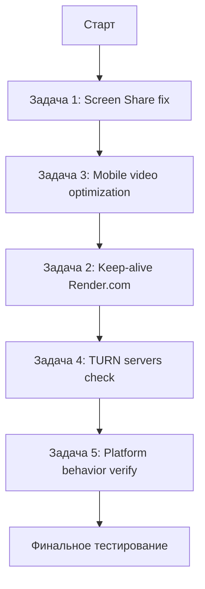

# План работ по проекту WebRTC P2P Video Chat

## Контекст проекта
Частный видео-чат на WebRTC P2P. Сигнальный сервер на Render.com (Express + Socket.IO).
Клиент — статический фронтенд в `public/`. TURN/STUN — бесплатные решения.

## Постановка задач (от пользователя)

### Задача 1. Исправить демонстрацию экрана на десктопе
- **Проблема:** При включении screen share экран локально демонстрируется, но пиру передаётся изображение с камеры, а не с экрана. Причина — ограничение на количество окон в логике layout + баг в `replaceTrack`.
- **Требование:** При демонстрации экрана изображение веб-камеры должно заменяться на изображение экрана у обоих участников.
- **Файлы:** `public/script.js` (функции `startScreenShare`, `stopScreenShare`, `updateUIAfterScreenShare`), возможно `public/css/styles.css`.

### Задача 2. Keep-alive запросы к Render.com
- **Проблема:** Бесплатный тариф Render.com усыпляет сервер через 1 час неактивности. Пользователь ждёт до 5 минут при первом запуске.
- **Требование:** Клиент (Web-RTC app) автоматически раз в час шлёт запрос на сервер в случайный момент внутри часа (не строго периодично, чтобы Render не блокировал как бот-трафик).
- **Файлы:** `server.js` (добавить GET /health route), `public/script.js` (добавить keep-alive интервал с рандомизацией).

### Задача 3. Оптимизация видеосигнала на мобильных
- **Проблема:** Перегрев матрицы камеры и быстрый разряд батареи из-за высокого разрешения трансляции с мобильного устройства.
- **Требование:** Оптимизировать видеосигнал — снизить разрешение/частоту кадров/битрейт для мобильных.
- **Файлы:** `public/script.js` (`mobileMediaConstraints`, добавление `RTCRtpSender.setParameters()` для ограничения битрейта).

### Задача 4. Проверка работоспособности TURN-серверов
- **Проблема:** Бесплатные TURN-серверы прописаны в `iceConfig`, но их работоспособность не проверена.
- **Требование:** Проверить, какие TURN-серверы отвечают, убрать нерабочие, оставить рабочие.
- **Файлы:** `public/script.js` (`iceConfig`), `server.js` (опционально — логирование ICE).

### Задача 5. Поведение мобильной и десктопной версий (уже реализовано, проверить)
- Десктоп: заблокировано переключение камеры на фронтальную — реализовано через `isMobile()` проверку в `switchCamera()`.
- Мобильная: нельзя поделиться экраном, но есть смена камеры — реализовано через CSS `body.mobile-device #feature-btn[data-feature="screenshare"] { display: none; }`.
- **Действие:** Проверить корректность, при необходимости доработать.

## Порядок выполнения
1. Задача 1 (screen share) — критичный баг, блокирует основной функционал.
2. Задача 3 (мобильная оптимизация) — независима, влияет на UX.
3. Задача 2 (keep-alive) — независима, добавляется на сервер и клиент.
4. Задача 4 (TURN проверка) — исследование + правки конфига.
5. Задача 5 (поведение версий) — финальная проверка.

## Диаграмма workflow

